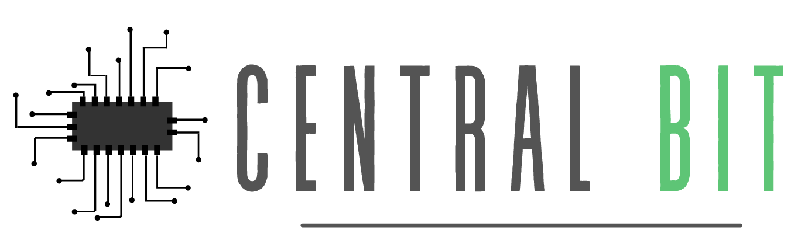

<h1 align="center">
  
</h1>

 

<h3 align="center">
  Educação como chave para promoção o desenvolvimento do país.
</h3>

## Sobre

Com o objetivo de auxiliar na formação de profissionais, incentivar indivíduos pela busca de conhecimento e colaborar com a comunidade de desenvolvedores para hardware, a **Central Bit** é uma plataforma de ensino que possibilita a qualificação de pessoas para o mercado de trabalho. Nela é unificado os mais diversos conteúdo sobre robótica, eletrônica, sistemas embarcados, entre outros.

Além da diversidade e qualidade dos conteúdos, os alunos irão desenvolver novas habilidades, trabalharão a criatividade uma vez que o conteúdo é multidisciplinar.

## Instalação

Para utilizar a health prevent technology em seu ambiente, clone este repositório e na pasta *frontend*. Caso utilize o Visual Studio é possível utilizar o [Live Server](https://marketplace.visualstudio.com/items?itemName=ritwickdey.LiveServer) para execução da aplicação web.

## Tecnologias

A plataforma é composta por aplicação web e API (Application Programming Interface). A web foi desenvolvida com JavaScript, HTML e CSS. A API disponível em [github.com](https://github.com/mateustoin/Health-Prevent-Technology-API) foi desenvolvida utilizando Python e FastAPI.

Este projeto foi desenvolvido na **Hackaton CCR 2º Edição** organizada pela Shawee. 

## Licença

Copyright © 2020 [Mateus Antonio da Silva](https://github.com/mateustoin), [João Victor Galvão](https://github.com/JVictorGalvao), [Laura de Faria Maranhão Ayres](https://github.com/lauradefaria), [Marismar da Costa Silva](https://github.com/marismarcosta), [Gustavo Eraldo da Silva](https://github.com/EraldoCi). 
This project is [MIT](https://github.com/EraldoCi/central-bit/blob/main/LICENSE) licensed.
